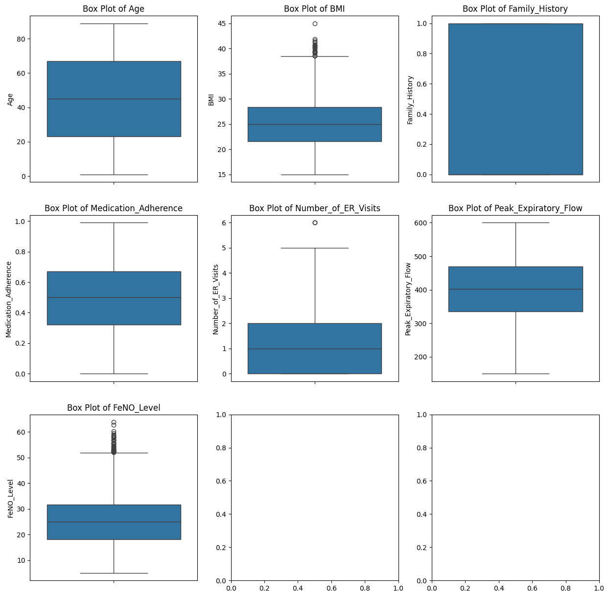

#  Task 1: Exploring and Visualizing a Simple Dataset

This project demonstrates how to **load, inspect, and visualize** a dataset using basic data science techniques. It focuses on understanding data distributions, relationships, and outliers using **histograms, scatter plots, and box plots**.

---

##  Objective

Learn how to:
- Load and inspect a dataset using `pandas`
- Explore data using summary statistics
- Visualize the structure and characteristics of numerical features

---

##  Dataset
- Dataset Used: **Iris Dataset** (or any simple health dataset with numerical features)
- Format: CSV (can also be loaded directly via `seaborn`)
- Columns include:  
  `Age`, `BMI`, `Family_History`, `Medication_Adherence`, `Number_of_ER_Visits`, `Peak_Expiratory_Flow`, `FeNO_Level`

---

## Technologies and Skills

-  **Pandas** for data loading and inspection
- **Matplotlib** and **Seaborn** for data visualization
-  **Descriptive statistics** using `.describe()`, `.info()`, etc.

---

##  Methodology

1. **Load the Dataset**:
   ```python
   import pandas as pd
   df = pd.read_csv('/content/synthetic_asthma_dataset.csv')  # Replace with actual file name

## Basic Inspection:

df.shape
df.columns
df.head()
df.info()
df.describe()

## Visualizations:

Histograms for each numerical feature to observe value distributions.
Box Plots to detect outliers.
 Scatter Plots to observe relationships between selected variables.


 
 
